# 🔲 FULL CUSTOM 4-BIT ALU — CADENCE VIRTUOSO

<div align="center">

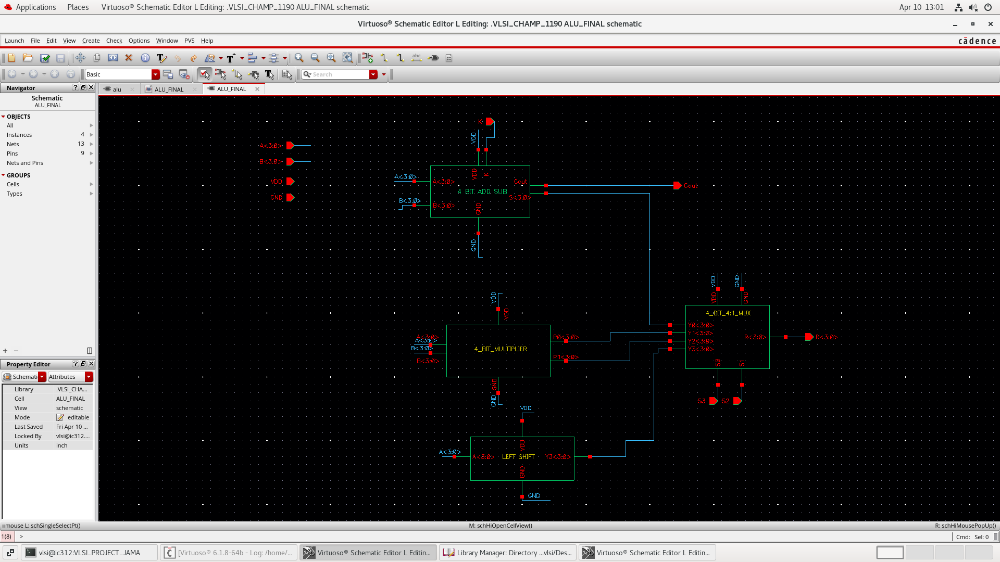

<br>

[](https://www.cadence.com/)
[]()
[]()
[]()
[]()

<br>

> A **full-custom 4-bit Arithmetic Logic Unit** designed entirely from scratch at the **CMOS transistor level** using **Cadence Virtuoso**. The design follows a strict bottom-up hierarchical methodology — from individual logic gates, through 4-bit wide gates, multiplexers, adders and multipliers, all the way to the top-level ALU block. Functional verification, transient analysis, power and delay analysis, layout design, and LVS verification were performed using **Cadence ADE**.

</div>

---

## 📑 Table of Contents

- [Project Overview](#-project-overview)
- [Design Hierarchy](#-design-hierarchy)
- [ALU Operations](#-alu-operations)
- [Module Descriptions](#-module-descriptions)
  - [Basic CMOS Gates](#1-basic-cmos-gates)
  - [4-Bit Wide Gates](#2-4-bit-wide-gates)
  - [Multiplexers](#3-multiplexers-mux)
  - [Arithmetic Circuits](#4-arithmetic-circuits)
  - [Top-Level ALU](#5-top-level-alu)
- [Schematics & Symbols](#-schematics--symbols)
- [Simulation Results](#-simulation-results)
- [Layout & LVS](#-layout--lvs-verification)
- [Repository Structure](#-repository-structure)
- [Tools Used](#-tools-used)
- [Authors](#-authors)

---

## 🧠 Project Overview

This project implements a **4-bit Arithmetic Logic Unit (ALU)** using a **full-custom CMOS design flow** in Cadence Virtuoso. Every component — from the most basic inverter to the complete ALU — was designed at the **transistor level**, without using any standard cell libraries.

### Key Highlights

| Feature | Detail |
|---|---|
| **Design Methodology** | Full Custom, Bottom-Up Hierarchical |
| **EDA Tool** | Cadence Virtuoso Schematic Editor + ADE |
| **Transistor Technology** | CMOS (PMOS + NMOS pairs) |
| **ALU Word Length** | 4-bit inputs (A[3:0], B[3:0]) |
| **Operations Supported** | AND, OR, XOR, NOT, ADD, SUBTRACT, MULTIPLY |
| **Operation Selection** | MUX-based with binary selection lines |
| **Verification** | Transient Analysis, Power, Delay, LVS |
| **Layout** | Physical layout completed for key cells |

---

## 🏗️ Design Hierarchy

The entire ALU was built **bottom-up** — each level uses cells from the level below it as building blocks.

```
┌──────────────────────────────────────────────────────┐
│                      TOP LEVEL                       │
│                    ┌──────────┐                      │
│                    │   ALU    │                      │
│                    └────┬─────┘                      │
├─────────────────────────┼────────────────────────────┤
│                  LEVEL 3 │ OPERATION BLOCKS          │
│   ┌─────────────┐   ┌───┴──────────┐   ┌──────────┐ │
│   │ 4-BIT ADDER │   │  MULTIPLIER  │   │4B 4:1 MUX│ │
│   └──────┬──────┘   └──────┬───────┘   └────┬─────┘ │
├──────────┼─────────────────┼────────────────┼────────┤
│          │        LEVEL 2  │  INTERMEDIATE  │        │
│  ┌───────┴───┐   ┌─────────┴──┐   ┌────────┴───┐    │
│  │ FULL ADDR │   │  4:1 MUX   │   │  2:1 MUX   │    │
│  └──────┬────┘   └─────┬──────┘   └────┬───────┘    │
├─────────┼──────────────┼───────────────┼─────────────┤
│         │    LEVEL 1   │  4-BIT GATES  │             │
│ ┌───────┴──┐ ┌─────────┴─┐ ┌──────────┴──┐          │
│ │4_BIT_AND │ │ 4_BIT_OR  │ │ 4_BIT_NOR   │          │
│ └──────┬───┘ └─────┬─────┘ └──────┬──────┘ ...      │
├────────┼───────────┼──────────────┼──────────────────┤
│        │   LEVEL 0 │  BASIC CMOS  │                  │
│ ┌──────┴─┐ ┌───────┴─┐ ┌─────────┴┐ ┌──────┐ ┌────┐ │
│ │CMOS_AND│ │ CMOS_OR │ │ CMOS_XOR │ │C_NOR │ │INV │ │
│ └────────┘ └─────────┘ └──────────┘ └──────┘ └────┘ │
└──────────────────────────────────────────────────────┘
```

---

## ⚙️ ALU Operations

The ALU is split into two sub-units — a **Logical ALU** and an **Arithmetic ALU** — whose outputs are fed into a **4-bit 4-to-1 MUX** controlled by 2 selection lines `S[1:0]`.

### Logical ALU

| S[1] | S[0] | Operation | Description |
|:---:|:---:|:---:|---|
| 0 | 0 | **A AND B** | Bitwise AND of 4-bit inputs |
| 0 | 1 | **A OR B** | Bitwise OR of 4-bit inputs |
| 1 | 0 | **A XOR B** | Bitwise XOR of 4-bit inputs |
| 1 | 1 | **NOT A** | Bitwise complement of A |

### Arithmetic ALU

| S[1] | S[0] | Operation | Description |
|:---:|:---:|:---:|---|
| 0 | 0 | **A + B** | 4-bit Addition (with Carry-out) |
| 0 | 1 | **A − B** | 4-bit Subtraction (2's complement) |
| 1 | 0 | **A × B** | 4-bit Multiplication |
| 1 | 1 | *Reserved* | — |

> A top-level **MODE** selection line chooses between the Logical ALU and Arithmetic ALU outputs.

---

## 📦 Module Descriptions

### 1. Basic CMOS Gates

All primitive gates were built using **complementary CMOS topology** (series/parallel PMOS pull-up network + series/parallel NMOS pull-down network). No standard cells were used.

| Cell Name | Type | Transistors | Notes |
|---|---|:---:|---|
| `CMOS_INV` / `Cmos_Inverter` | Inverter | 2 | 1 PMOS + 1 NMOS |
| `CMOS_NAND` | NAND | 4 | 2P (parallel) + 2N (series) |
| `CMOS_AND` | AND | 6 | NAND + Inverter |
| `CMOS_NOR` | NOR | 4 | 2P (series) + 2N (parallel) |
| `CMOS_OR` | OR | 6 | NOR + Inverter |
| `CMOS_XOR` | XOR | 8–12 | Transmission-gate based |

---

### 2. 4-Bit Wide Gates

Each 4-bit gate instantiates **4 copies** of the corresponding basic CMOS gate, operating on 4-bit buses `A[3:0]` and `B[3:0]` in parallel.

| Cell Name | Operation | Inputs | Output |
|---|---|---|---|
| `4_BIT_AND` | Bitwise AND | A[3:0], B[3:0] | Y[3:0] |
| `4_BIT_OR` | Bitwise OR | A[3:0], B[3:0] | Y[3:0] |
| `4_BIT_NOR` | Bitwise NOR | A[3:0], B[3:0] | Y[3:0] |
| `4_BIT_NOT` | Bitwise NOT | A[3:0] | Y[3:0] |

---

### 3. Multiplexers (MUX)

| Cell Name | Type | Select Lines | Description |
|---|---|:---:|---|
| `2_1Mux` | 2-to-1 MUX | S[0] | Selects between 2 single-bit inputs |
| `4_1_MUX` | 4-to-1 MUX | S[1:0] | Selects between 4 single-bit inputs |
| `4_BIT_4_1_MUX` | 4-bit wide 4-to-1 MUX | S[1:0] | Selects between 4 four-bit buses |

> The `4_BIT_4_1_MUX` is the **core operation selector** of the ALU — it takes the outputs of all ALU operations and routes the selected one to the final output.

---

### 4. Arithmetic Circuits

#### Full Adder (1-bit)

A standard **1-bit full adder** implementing:
- **Sum** = A ⊕ B ⊕ Cin
- **Cout** = (A · B) + (Cin · (A ⊕ B))

Built using `CMOS_XOR`, `CMOS_AND`, and `CMOS_OR` cells.

#### 4-Bit Ripple Carry Adder

Four `full_adder` cells chained together, with the carry-out of each stage feeding into the carry-in of the next.

```
A[0],B[0] → [FA0] → Sum[0], C0
A[1],B[1] → [FA1] → Sum[1], C1  (Cin = C0)
A[2],B[2] → [FA2] → Sum[2], C2  (Cin = C1)
A[3],B[3] → [FA3] → Sum[3], Cout (Cin = C2)
```

#### 4-Bit Multiplier

Implements **combinational array multiplication** using partial product generation (AND gates) and a tree of full adders to accumulate partial products into the final 8-bit product.

---

### 5. Top-Level ALU

The top-level `ALU` cell integrates:
- `alu_logical` sub-block (AND, OR, XOR, NOT)
- `alu_arithmetic` sub-block (ADD, SUB, MULTIPLY)
- `4_BIT_4_1_MUX` for operation selection

| Signal | Width | Direction | Description |
|---|:---:|---|---|
| `A` | 4-bit | Input | Operand A |
| `B` | 4-bit | Input | Operand B |
| `S` | 2-bit | Input | Operation select lines |
| `MODE` | 1-bit | Input | Logical (0) / Arithmetic (1) mode |
| `OUT` | 4-bit | Output | Result |
| `COUT` | 1-bit | Output | Carry out (arithmetic mode) |

---

## 📐 Schematics & Symbols

### Gate-Level Schematics

| AND Gate | OR Gate | XOR Gate |
|:---:|:---:|:---:|
| 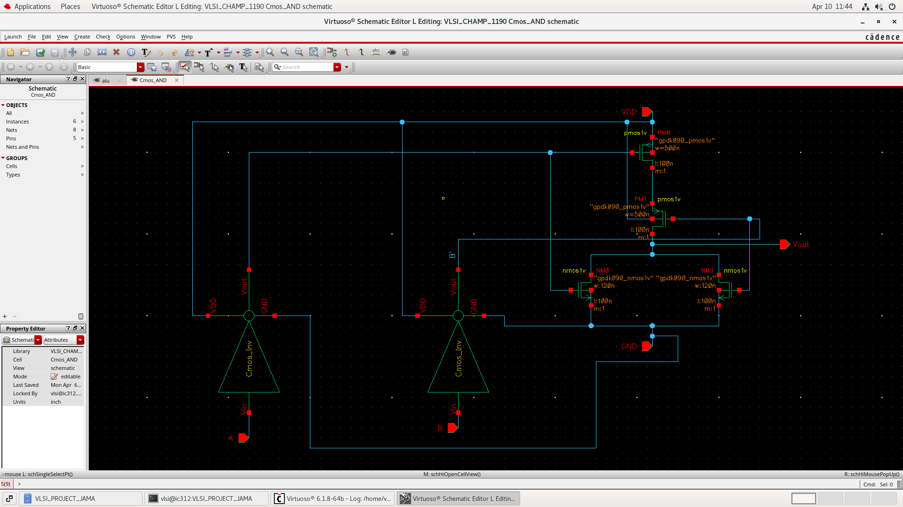 | 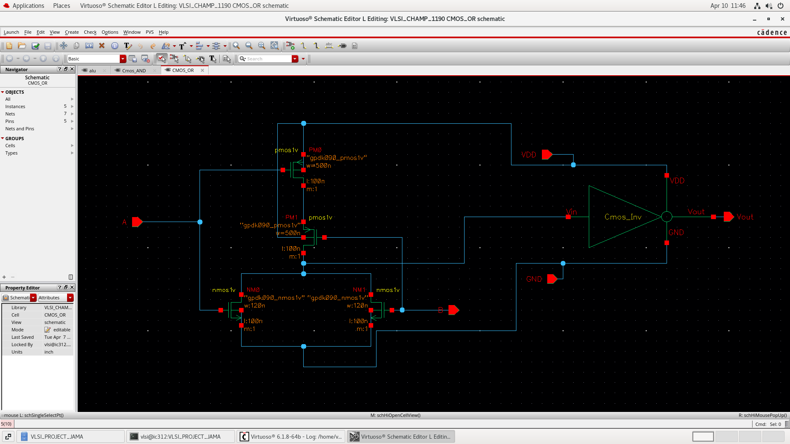 | 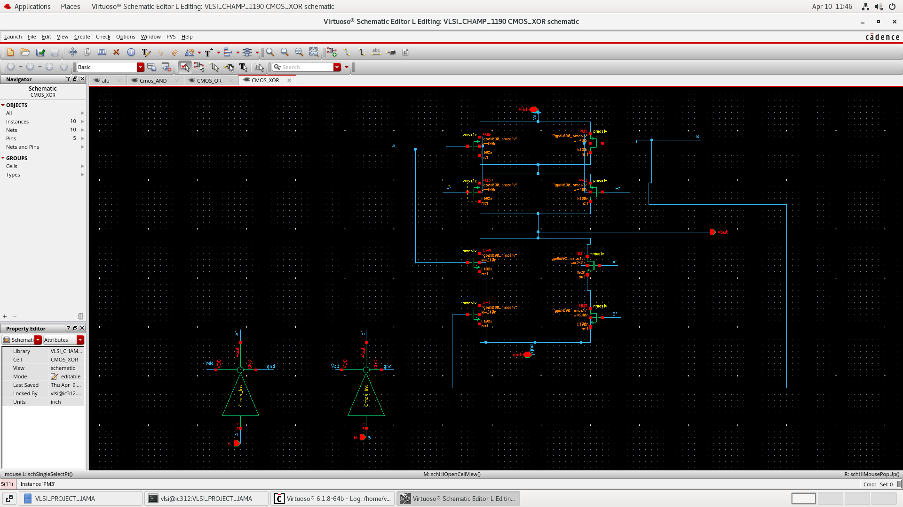 |

### ALU Schematics & Symbols

| Arithmetic ALU Schematic | Arithmetic ALU Symbol |
|:---:|:---:|
|  |  |

| Logical ALU Schematic | Logical ALU Symbol |
|:---:|:---:|
| 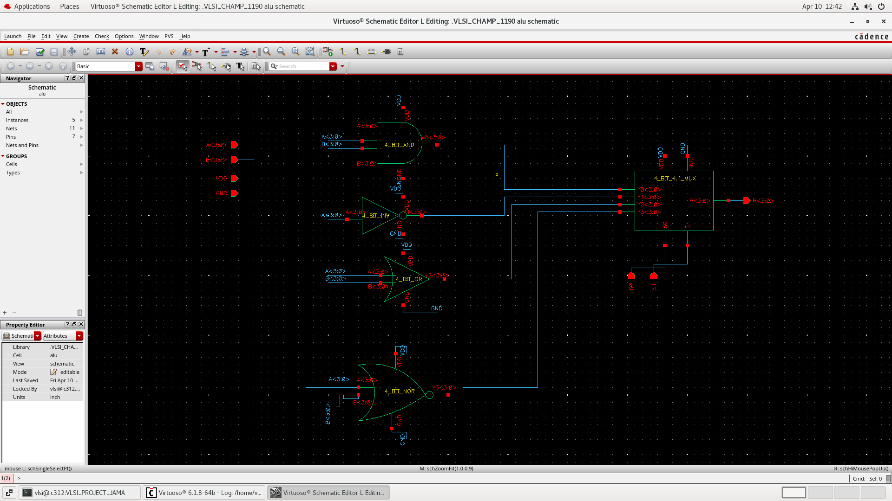 | 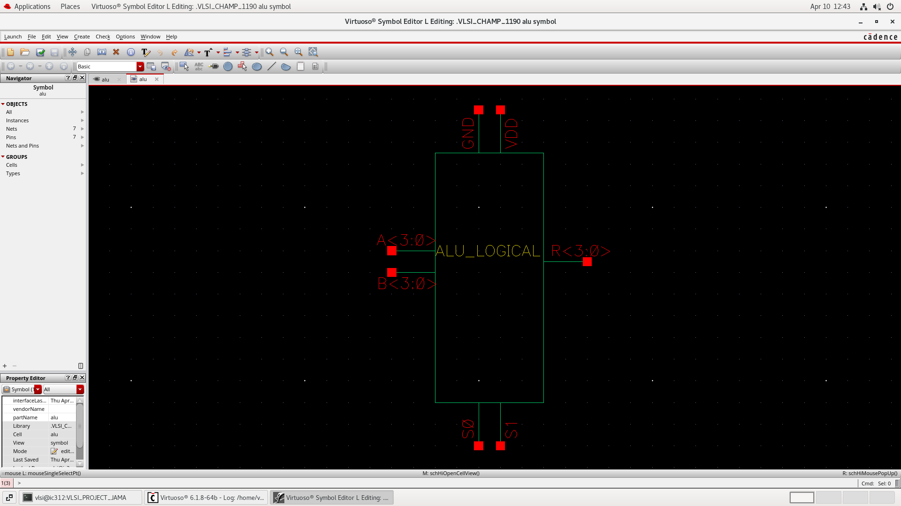 |

### Block Diagrams

| AND Block | Full Adder | 4-Bit Adder | Multiplier | ALU Top |
|:---:|:---:|:---:|:---:|:---:|
| 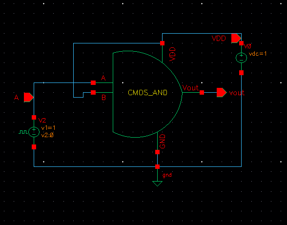 | 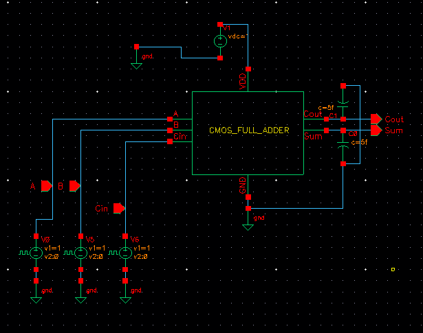 |  | 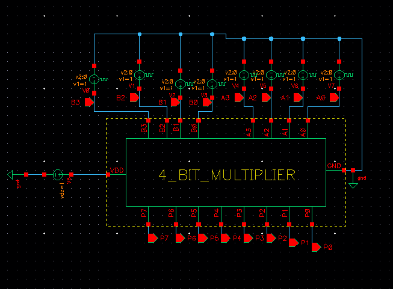 | 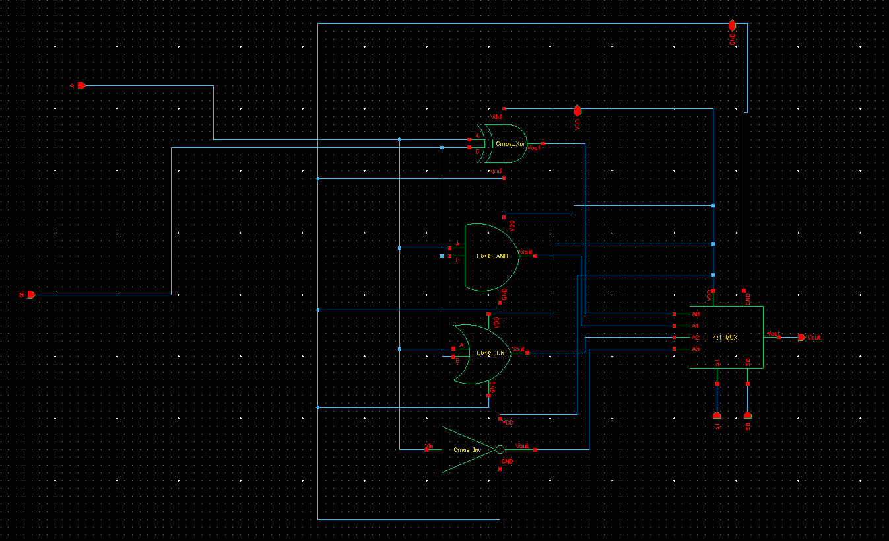 |

---

## 📊 Simulation Results

All simulations were performed in **Cadence ADE (Analog Design Environment)** using SPICE-level transient analysis.

### AND Gate Analysis

| Transient Analysis | Power Analysis |
|:---:|:---:|
| 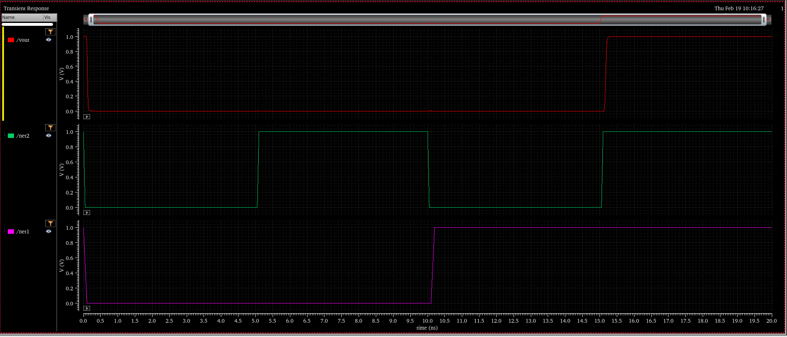 | 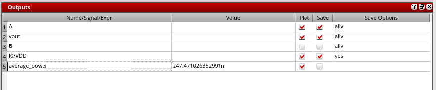 |

| Delay Calculation | Waveform with Current |
|:---:|:---:|
| 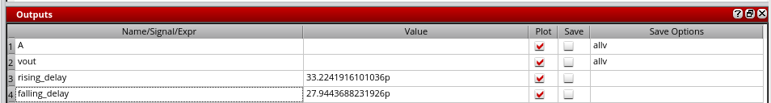 | 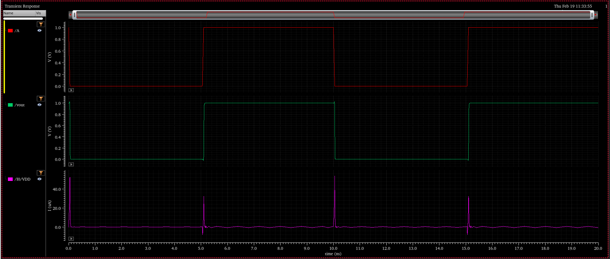 |

---

### OR Gate Analysis

| Transient Waveform | Power Analysis | Delay Calculation |
|:---:|:---:|:---:|
| 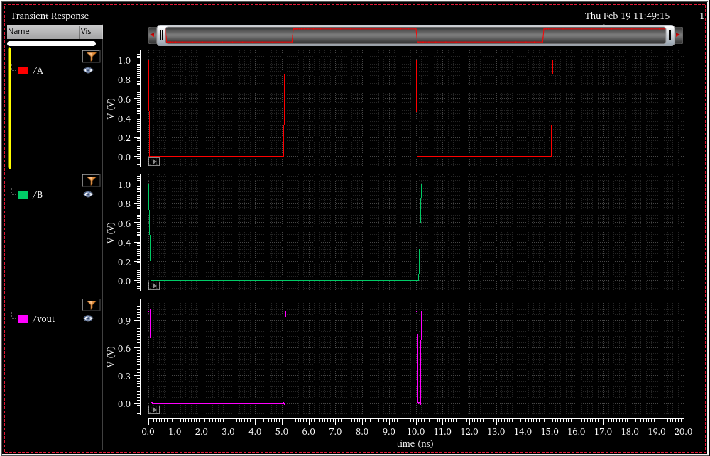 | 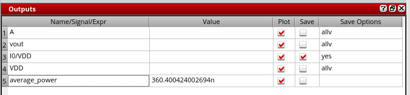 | 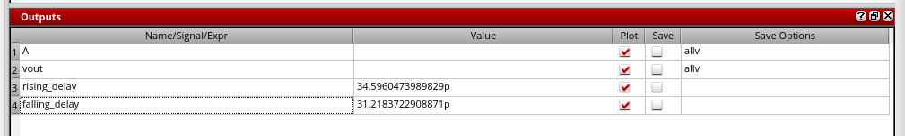 |

---

### XOR Gate Analysis

| Transient Waveform | Power Analysis | Delay Calculation |
|:---:|:---:|:---:|
| 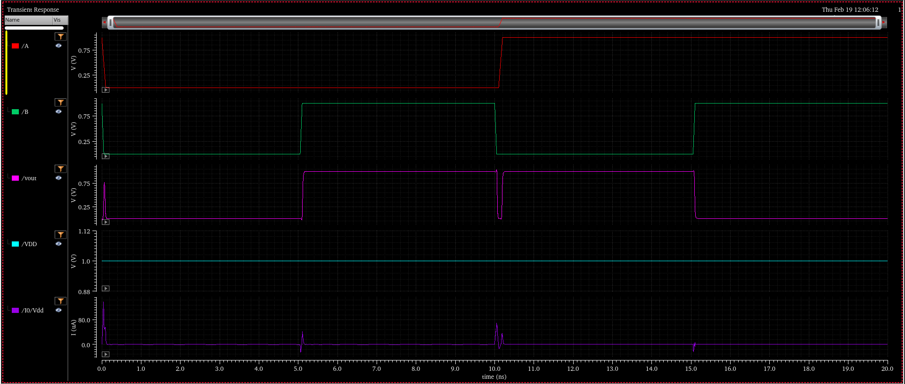 | 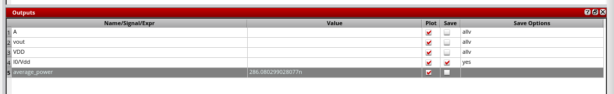 | 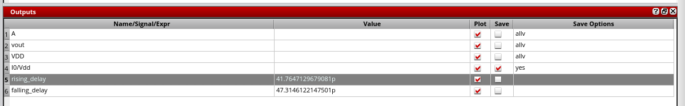 |

---

### Inverter Analysis

| Delay Analysis | Power & Delay |
|:---:|:---:|
|  | 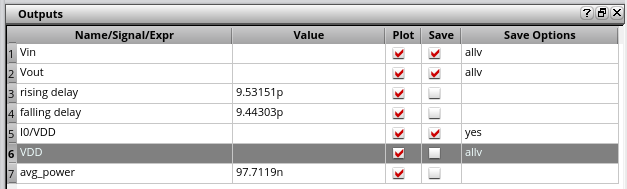 |

---

### Full Adder & 4-Bit Adder Analysis

| Full Adder Schematic | Full Adder Waveform |
|:---:|:---:|
| 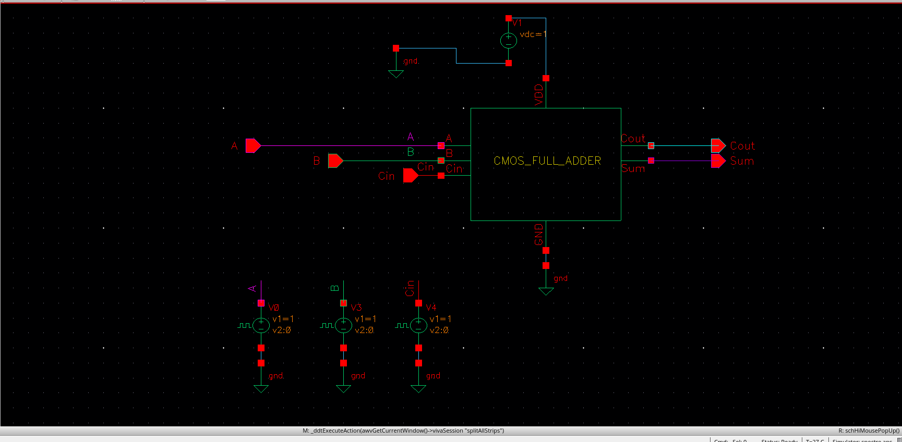 | 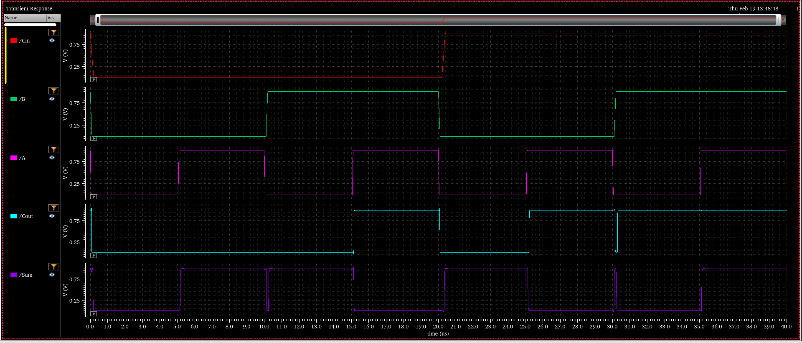 |

| Full Adder Analysis | 4-Bit Adder Analysis |
|:---:|:---:|
|  |  |

---

### 4-Bit Adder Layout Analysis

| Layout View 1 | Layout View 2 | Adder-Subtractor |
|:---:|:---:|:---:|
| 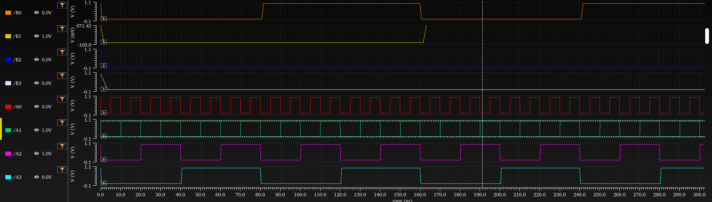 | 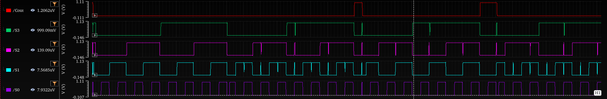 |  |

---

### Multiplier Analysis

| Multiplier Analysis 1 | Multiplier Analysis 2 |
|:---:|:---:|
|  |  |

---

### ALU Top-Level

| ALU View 1 | ALU View 2 |
|:---:|:---:|
|  | 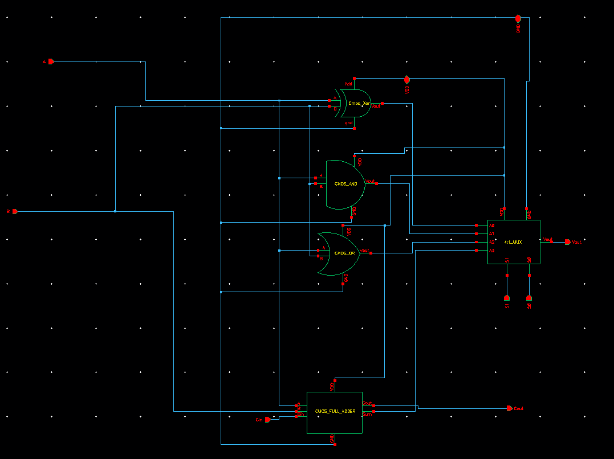 |

---

## 🗂️ Layout & LVS Verification

Physical layout was completed for the following cells in **Cadence Virtuoso Layout Editor**. **LVS (Layout vs. Schematic)** checks were run and passed for all laid-out cells.

| Cell | Layout Done | LVS Passed |
|---|:---:|:---:|
| `Cmos_Inverter` | ✅ | ✅ |
| `CMOS_AND` | ✅ | ✅ |
| `CMOS_OR` | ✅ | ✅ |
| `CMOS_NOR` | ✅ | ✅ |
| `4_BIT_NOT` | ✅ | ✅ |
| `4_BIT_AND` | ✅ | ✅ |
| `4_BIT_OR` | ✅ | ✅ |
| `4_BIT_NOR` | ✅ | ✅ |
| `4_bit_4_1_mux` | ✅ | ✅ |

> LVS database files (`.lvsdb`) confirm that the physical layout matches the extracted schematic netlist for all above cells.

---

## 📁 Repository Structure

```
FULL_CUSTOM_4BIT_ALU_CADENCE/
│
├── 📂 VLSI_PROJECT_JAMA/               ← Cadence project root
│   ├── CMOS_INV/                       ← Inverter cell (Cadence data)
│   ├── CMOS_NAND/                      ← NAND gate
│   ├── CMOS_AND/                       ← AND gate
│   ├── CMOS_NOR/                       ← NOR gate
│   ├── CMOS_OR/                        ← OR gate
│   ├── CMOS_XOR/                       ← XOR gate
│   ├── Cmos_Inverter/                  ← Inverter (with layout)
│   ├── 4_BIT_AND/                      ← 4-bit AND gate
│   ├── 4_BIT_OR/                       ← 4-bit OR gate
│   ├── 4_BIT_NOR/                      ← 4-bit NOR gate
│   ├── 4_BIT_NOT/                      ← 4-bit NOT gate
│   ├── 2_1Mux/                         ← 2-to-1 Multiplexer
│   ├── 4_1_MUX/                        ← 4-to-1 Multiplexer
│   ├── 4_BIT_4_1_MUX/                  ← 4-bit 4-to-1 MUX
│   ├── full_adder/                     ← 1-bit Full Adder
│   ├── 4_BIT_ADDER/                    ← 4-bit Ripple Carry Adder
│   ├── MULTIPLIER/                     ← 4-bit Multiplier
│   └── ALU/                            ← Top-level ALU
│
├── 📂 images/                          ← All screenshots & analysis images
│   ├── pics/                           ← Gate schematics & ALU symbols
│   ├── ALU/                            ← ALU block diagrams
│   ├── and_analysis/                   ← AND gate simulation results
│   ├── or_analysis/                    ← OR gate simulation results
│   ├── xor_gate_pics/                  ← XOR gate simulation results
│   ├── inverter/                       ← Inverter analysis
│   ├── full_adder/                     ← Full adder & 4-bit adder analysis
│   ├── 4_BIT_ADDER/                    ← 4-bit adder layout & analysis
│   └── MULTIPLIER/                     ← Multiplier analysis
│
└── README.md
```

---

## 🛠️ Tools Used

| Tool | Purpose |
|---|---|
| **Cadence Virtuoso Schematic Editor** | Schematic capture for all cells |
| **Cadence Virtuoso Layout Editor** | Physical layout design |
| **Cadence ADE (Analog Design Environment)** | SPICE simulation setup & results |
| **Cadence Spectre / UltraSim** | Transient, DC, and power simulation |
| **Cadence LVS (Layout vs. Schematic)** | Physical verification |

---

## 👤 Authors

| Name | GitHub |
|---|---|
| **T Aakash** | [@Aakash1517](https://github.com/Aakash1517) |
| **V Adhi Ponraj** | — |

---

## 📄 License

This project is intended for **academic and educational purposes**. Feel free to reference it for learning VLSI design concepts with Cadence Virtuoso.

---

<div align="center">

**⭐ If this project helped you learn VLSI design, consider giving it a star! ⭐**

Made with ❤️ using Cadence Virtuoso

</div>
